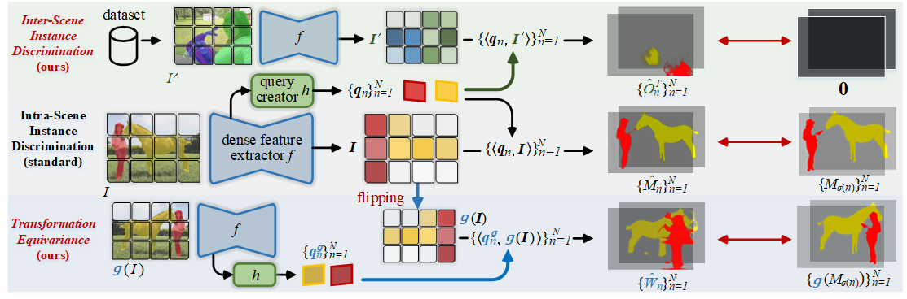

# Instance_Unique_Querying
<!--  -->

# Learning Equivariant Segmentation with Instance-Unique Querying (Under construction)

<!--  -->

  

  Overview of our new training framework for query-based instance segmentation. Rather than current intra-scene training paradigm, our framework addresses inter-scene instance discrimination and transformation equivariance for discriminative instance query embedding learning.

Learning Equivariant Segmentation with Instance-Unique Querying 

This is official repo for Learning Equivariant Segmentation with Instance-Unique Querying. Our full implenmentation will be availble at [mmdetection](https://github.com/open-mmlab/mmdetection) for easy-to-use, stay tuned!

## Abstract
Prevalent state-of-the-art instance segmentation methods fall into a query-based scheme, in which instance masks are derived by querying the image feature using a set of instance-aware embeddings. In this work, we devise a new training framework that boosts query-based models through discriminative query embedding learning. It explores two essential properties, namely dataset-level uniqueness and transformation equivariance, of the relation between queries and instances. First, our algorithm uses the queries to retrieve the corresponding instances from the whole training dataset, instead of only searching within individual scenes. As querying instances across scenes is more challenging, the segmenters are forced to learn more discriminative queries for effective instance separation. Second, our algorithm encourages both image (instance) representations and queries to be equivariant against geometric transformations, leading to more robust, instance-query matching. 
